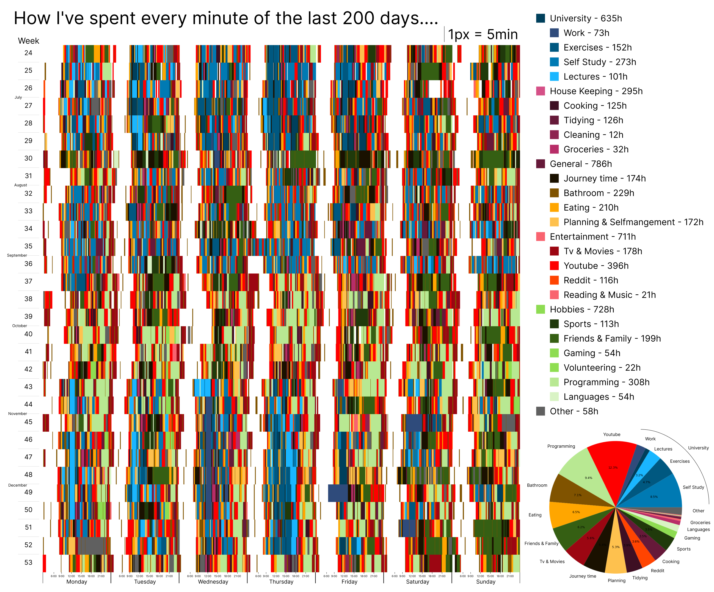

# Time Analyer

This short python script allows generating pixel and pie plots from [Toggl Track](https://toggl.com/track/) CSV data.



## Installation

Install the packages in [requirements.txt](./requirements.txt) using 

```
python.exe -m pip install -r requirements.txt
```

> Note: I recommend to create a [venv](https://docs.python.org/3/library/venv.html) first


## Usage

Place your [Toggl Track](https://toggl.com/track/) CSV File(or similar) into the root directory.
It must have the columns `Client,Project,Description,Tags,Start date, Start time, End date, End time, Duration`.

In [config.py](./config.py) you can configure the look and size of the plot.

The plotter will try to find a color from the colormap depending on the tags, project, client provided and color the specific pixels accordingly.